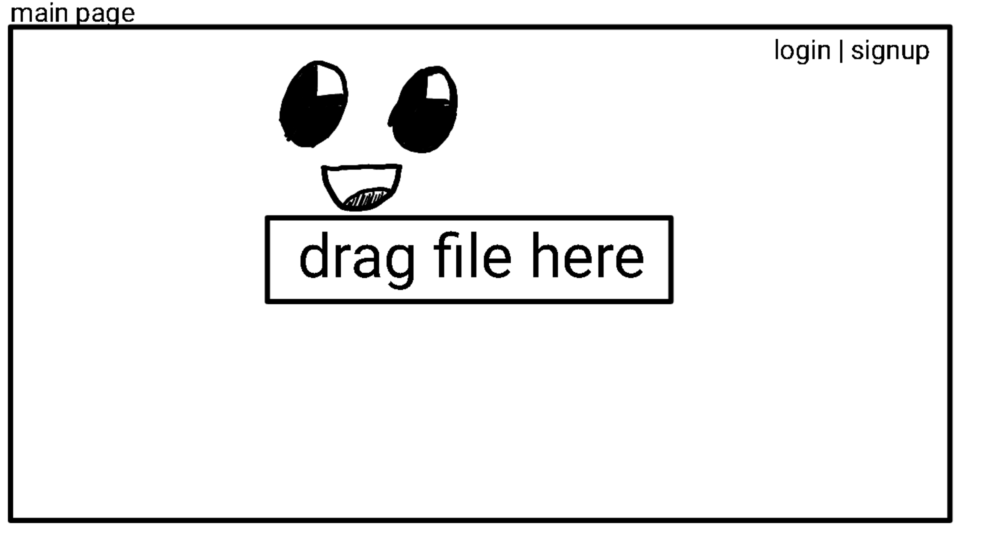

# [file-store](https://my-fs-frontend.herokuapp.com)


### Table of Contents
* [technology used](#technology-used)
* [general approach](#general-approach)
* [installation](#installation)
* [user stories](#user-stories)
* [wireframes](#wireframes)
* [unsolved problems](#unsolved-problems)
* [code snippets](#code-snippets)

## Technology used
* MongoDB
* Express
* React
* Node

## General Approach
For this project, I started with the user-stories for my app. They are very simple, however the implementation was a bit trickier than I had planned out. After user-stories 

## Installation
Installation is as follows
* host mongodb instance somewhere
* add DB_URL, JWT_SECRET, and BACKEND variables to your backend environment (where BACKEND is the final URL of your backend server and DB_URL is the final URL of your mongodb instance)
* add BACKEND variable to your frontend environment
* run `npm i` on frontend and backend environments and start them.

## User Stories
This app is for people who would like yet another online file store with minimal rate-limits and a simple interface.

## Wireframes


## Unsolved Problems
* [ ] Currently this project does not have in-built rate-limiting. In the future I would like to add this in, giving a quota per user and for the server as a whole.
* [ ] Currently this project has a lazy-delete feature, in the future to help with quota management I would like to implement this in such a way that the backend will not get full of inaccessible files.

## Code Snippets

```js
// FileUploader.jsx
// upload a file with progress, actively adding in the user-id to the request to assign the file to a user
  useEffect(() => {
    console.log('Upload', id);
    const request = new XMLHttpRequest();
    request.open('POST', `${BACKEND}/`);
    if (isAuthenticated) {
      request.setRequestHeader('X-User-ID', id);
    }
    const data = new FormData();
    data.append('file', file);
    request.upload.addEventListener('progress', event => {
      setProgress(event.loaded / event.total);
    });
    request.addEventListener('readystatechange', _ => {
      if (request.readyState === XMLHttpRequest.DONE) {
        setCopy(request.responseText);
        setFiles(files.concat(request.responseText));
      }
    });
    request.send(data);
  }, [file]);
```
```js
app.post('/', async (rq, rs) => {
  const id = rq.headers['x-user-id'];
  const file = rq.files.file;
  const { name, mimetype } = file;
  const hash = getSha256(file.data);
  let dbFile = await DBFile.findOne({ hash });
  let ext = `${rq.files.file.name.split('.').pop()}`;
  if (!dbFile) {
    try {
      await file.mv(`${__dirname}/static/${hash}.${ext}`);
      dbFile = new DBFile({
        hash,
        name,
        mimetype,
        size: file.size,
      });
      await dbFile.save();
    } catch (error) {
      return rs.send(error);
    }
  }
  if (id) {
    const user = await User.findOne({ _id: id });
    user.files.push(dbFile.id);
    await user.save();
  }
  rs.send(`${BACKEND}/${numToLetter(dbFile.id)}`);

});
```
```js
/**
 * @param {number} num 
 * @returns {string} string
 */
function numToLetter(num) {
  if (isNaN(num)) {
    return NaN;
  }
  let quotient = Number(num) + 456_976;
  let number = [];
  let alphabet = 'abcdefghijklmnopqrstuvwxyz';
  do {
    const remainder = quotient % 26;
    quotient = Math.floor(quotient / 26);
    number.push(alphabet[remainder]);
  } while (quotient);
  return number.reverse().join('');
}

/**
 * @param {string} letters 
 * @returns {number}
 */
function lettersToNum(letters) {
  if (!/^[a-z]+$/.test(letters)) {
    return -1;
  }
  return letters
    .split('')
    .reverse()
    .map(char => 'abcdefghijklmnopqrstuvwxyz'.indexOf(char))
    .reduce((acc, cur, idx) => acc + cur * 26 ** idx)
    - 456_976;
}
```
